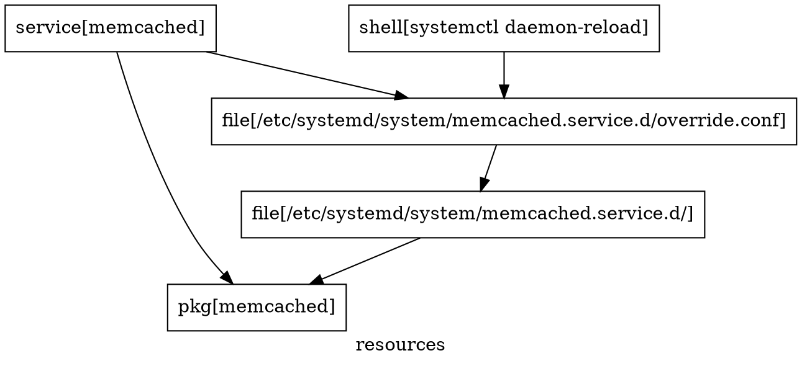
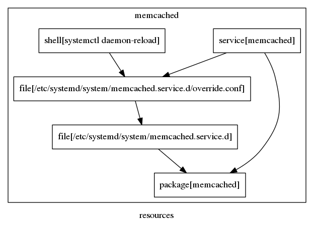

## Quickstart

Welcome to Gru!

Considering that you have installed and configured Gru, we will now
walk you through the creation of a simple module, which will
take care of installing and configuring
[memcached](https://memcached.org/) for us.

The instructions here should be pretty simple for everyone to follow,
and should serve as an example on how to create modules for Gru.

The instructions provided in this document have been tested on an
[Arch Linux](https://www.archlinux.org/) system, but they should also
apply to other systems for which Gru has support.

## Setting up the site repo

The `site repo` in Gru is what contains modules and data files.

Technically speaking the site repo is a Git repository,
which is being distributed to our minions, this way making it possible
for remote systems to sync from it and evaluate modules.

This is how a typical empty site repo structure looks like.

```bash
$ tree site
site
├── code
└── data

2 directories, 0 files
```

The `code` directory is used for modules, which are written in the
[Lua](https://www.lua.org/) programming language. Lua is what forms the
DSL language of Gru, and is used for creating resources and registering
them to the `catalog`.

The `data` directory is being used for static content and
file templates, which are used by resources.

You can also find an example site repo in the
[example site repo](../site) directory from the Gru repository.

This is also the place where you can find the module we will
create in this document, so you might want to grab
the example site repo first while you work on the instructions from
this document.

## Writing the module

In the beginning of this document we have mentioned that we will be
installing and configuring [memcached](https://memcached.org/) on our
systems. The steps we need to perform in order to do that can be
summarized as follows - installing the needed package, configuring the
service and afterwards starting the service.

As mentioned earlier, modules are written in
[Lua](https://www.lua.org/). In our Lua code we instantiate
resources and also register them to the catalog.

Let us begin with installing the required packages by creating
our first resource.

```lua
-- Manage the memcached package
memcached_pkg = pkg.new("memcached")
memcached_pkg.state = "present"
```

What we do in the above Lua code is to instantiate a new
[package resource](https://godoc.org/github.com/dnaeon/gru/resource#Package)
by calling the `pkg.new()` constructor. Each resource has a `new`
constructor, which accepts one argument - the *resource name*.

The created resource is returned and assigned to the `memcached_pkg`
variable, which we can use to modify resource attributes and also
register the resource to the catalog, as we will do a bit later.

By default the `memcached` service listens only on localhost, so
if we want to change that and listen on all interfaces we will have to
adjust the
[systemd](https://www.freedesktop.org/wiki/Software/systemd/) unit
for the service.

One way to achieve that is to use systemd drop-in units, and that is
what we will do now.

First, let's create the needed directory for our drop-in unit.

```lua
-- Path to the systemd drop-in unit directory
systemd_dir = "/etc/systemd/system/memcached.service.d/"

-- Manage the systemd drop-in unit directory
unit_dir = file.new(systemd_dir)
unit_dir.state = "present"
unit_dir.filetype = "directory"
unit_dir.require = {
   memcached_pkg:ID(),
}
```

In order to create the systemd drop-in directory for our unit,
we create a [file resource](https://godoc.org/github.com/dnaeon/gru/resource#File), and
afterwards set any attributes of the resource.

What you should also notice is that we have created a dependency
relation between our `file` resource and the `pkg` resource,
which manages the `memcached` package. Doing this allows us to
create resource dependencies, so that we define the proper way
resources should be evaluated and processed.

When creating resource dependencies we use the *resource id* for the
resource to which we want to link to. The *resource id* is a string,
which comprises of the *resource type* and the *resource name*.

You can get the id of a resource by calling it's `ID()` method.

Now, let's install the actual drop-in unit file.

```lua
-- Manage the systemd drop-in unit
unit_file = file.new(systemd_dir .. "override.conf")
unit_file.state = "present"
unit_file.mode = tonumber("0644", 8)
unit_file.source = "data/memcached/memcached-override.conf"
unit_file.require = {
   unit_dir:ID(),
}
```

The above `file` resource will take care of installing the
`override.conf` drop-in unit to it's correct location.

You may have also noticed the `source` attribute that we have used in our
resource - that attribute tells where in the site directory the
actual source file resides.

And this is what the actual drop-in unit file looks like, which
will be used as the source for our resource.

```ini
[Service]
ExecStart=
ExecStart=/usr/bin/memcached
```

Once we install the systemd drop-in unit we need to tell
`systemd(1)` to re-read it's configuration, so the next resource
takes care of that as well.

```lua
-- Instruct systemd(1) to reload it's configuration
systemd_reload = shell.new("systemctl daemon-reload")
systemd_reload.require = {
   unit_file:ID(),
}
```

The next resource takes care of enabling and starting the memcached
service.

```lua
-- Manage the memcached service
memcached_svc = service.new("memcached")
memcached_svc.state = "running"
memcached_svc.enable = true
memcached_svc.require = {
   memcached_pkg:ID(),
   unit_file:ID(),
}
```

As a last step we need to do is to actually register our
resources to the catalog, so the next Lua chunk does that.

```lua
-- Finally, register the resources to the catalog
catalog:add(memcached_pkg, unit_dir, unit_file, systemd_reload, memcached_svc)
```

With all that we have now created our first module, which should
take care of installing and configuring memcached for us!

And this is how our site repo looks like once we have everything in
place.

```bash
$ tree site
site
├── code
│   └── memcached.lua
└── data
    └── memcached
        └── memcached-override.conf

3 directories, 2 files
```

## Resource Dependencies

In the previous chapter of this document we have created a number of
resources, which took care of installing and configuring memcached.

What you should have also noticed is that in most of the resources we
have used resource dependencies.

Before the resources are being processed by the catalog, Gru is
building a [DAG graph](https://en.wikipedia.org/wiki/Directed_acyclic_graph)
of all resources and attempts to perform a
[topological sort](https://en.wikipedia.org/wiki/Topological_sorting)
on them, in order to determine the proper order of resource execution.

Considering the example memcached module we have already created, lets
see what it's DAG graph looks like.

In order to do that we will use the `gructl graph` command.

```bash
$ gructl graph code/memcached.lua
```

Executing the above command generates the graph representation for
our resources.



The result of the `gructl graph` command is a representation of the
dependency graph in the
[DOT language](https://en.wikipedia.org/wiki/DOT_(graph_description_language)).

If we pipe the above result to `dot(1)` we can generate a visual
representation of our graph, e.g.:

```bash
$ gructl graph site/code/memcached.lua | dot -O -Tpng
```

And this is how the dependency graph for our memcached module looks like.



Using `gructl graph` we can see what the resource execution
order would look like and it can also help us identify
circular dependencies in our resources.

## Applying Configuration

Applying configuration in Gru can be done in a couple of ways -
standalone and orchestration mode.

In standalone mode configuration is being applied on the local system,
while in orchestration mode a task is being pushed to the remote
minions for processing.

## Standalone mode

Let's see how we can apply the configuration from the module we've
prepared so far on the local system using the standalone mode.

The command we need to execute is `gructl apply`.

```bash
$ sudo gructl apply site/code/memcached.lua
```

Executing the above command generates the following output from our
resources.

```bash
$ sudo gructl apply site/code/memcached.lua
2016/07/08 16:41:52 Loaded 5 resources
2016/07/08 16:41:52 pkg[memcached] is absent, should be present
2016/07/08 16:41:52 pkg[memcached] installing package
2016/07/08 16:41:53 pkg[memcached] resolving dependencies...
2016/07/08 16:41:53 pkg[memcached] looking for conflicting packages...
2016/07/08 16:41:53 pkg[memcached]
2016/07/08 16:41:53 pkg[memcached] Packages (1) memcached-1.4.25-1
2016/07/08 16:41:53 pkg[memcached]
2016/07/08 16:41:53 pkg[memcached] Total Installed Size:  0.14 MiB
2016/07/08 16:41:53 pkg[memcached]
2016/07/08 16:41:53 pkg[memcached] :: Proceed with installation? [Y/n]
2016/07/08 16:41:53 pkg[memcached] checking keyring...
2016/07/08 16:41:53 pkg[memcached] checking package integrity...
2016/07/08 16:41:53 pkg[memcached] loading package files...
2016/07/08 16:41:53 pkg[memcached] checking for file conflicts...
2016/07/08 16:41:53 pkg[memcached] checking available disk space...
2016/07/08 16:41:53 pkg[memcached] :: Processing package changes...
2016/07/08 16:41:53 pkg[memcached] installing memcached...
2016/07/08 16:41:53 pkg[memcached] Optional dependencies for memcached
2016/07/08 16:41:53 pkg[memcached]     perl: for memcached-tool usage [installed]
2016/07/08 16:41:53 pkg[memcached] :: Running post-transaction hooks...
2016/07/08 16:41:53 pkg[memcached] (1/1) Updating manpage index...
2016/07/08 16:41:53 pkg[memcached]
2016/07/08 16:41:53 file[/etc/systemd/system/memcached.service.d/] is absent, should be present
2016/07/08 16:41:53 file[/etc/systemd/system/memcached.service.d/] creating resource
2016/07/08 16:41:53 file[/etc/systemd/system/memcached.service.d/override.conf] is absent, should be present
2016/07/08 16:41:53 file[/etc/systemd/system/memcached.service.d/override.conf] creating resource
2016/07/08 16:41:53 shell[systemctl daemon-reload] is absent, should be present
2016/07/08 16:41:53 shell[systemctl daemon-reload] executing command
2016/07/08 16:41:53 shell[systemctl daemon-reload]
2016/07/08 16:41:53 service[memcached] is stopped, should be running
2016/07/08 16:41:53 service[memcached] starting service
2016/07/08 16:41:53 service[memcached] systemd job id 2336 result: done
2016/07/08 16:41:53 service[memcached] resource is out of date
2016/07/08 16:41:53 service[memcached] enabling service
2016/07/08 16:41:53 service[memcached] symlink /etc/systemd/system/multi-user.target.wants/memcached.service -> /usr/lib/systemd/system/memcached.service
```

From the output we can also see that the order of execution of our
resources is correct as we've also seen from the DAG graph in the
previous section.

One last thing we need to do is check the status of the service.

```bash
$ systemctl status memcached
● memcached.service - Memcached Daemon
   Loaded: loaded (/usr/lib/systemd/system/memcached.service; enabled; vendor preset: disabled)
  Drop-In: /etc/systemd/system/memcached.service.d
           └─override.conf
   Active: active (running) since Fri 2016-07-08 16:41:53 EEST; 2min 27s ago
 Main PID: 12297 (memcached)
   CGroup: /system.slice/memcached.service
           └─12297 /usr/bin/memcached

Jul 08 16:41:53 mnikolov-laptop systemd[1]: Started Memcached Daemon.
```

Everything looks good and we can see our drop-in unit being used as well.

## Orchestration

Besides being able to apply configuration on the local system, Gru
can also be used to orchestrate remote systems by pushing tasks
for processing.

A task simply tells the remote systems (called *minions*) which
module should be loaded and processed from the site repo using a
given `environment`.

The `environment` is essentially a Git branch from our site repo,
which is being fetched by the remote minions and used during
catalog processing. The default `environment` which is sent to
minions is called `production`, so make sure to create the
`production` branch in your Git site repo before pushing
new tasks to them.

First, make sure that your site repo resides in Git and is available
for the remote minions to fetch from it.

Afterwards, we should start our minions.

```bash
$ sudo gructl serve --siterepo https://github.com/you/gru-site
```

Make sure to specify the correct URL to your site repo in the
command above.

Once you've got all your minions started, let's see some useful
commands that we can use with our minions.

Using the `gructl list` command we can see the currently registered
minions.

```bash
$ gructl list
MINION                                  NAME
46ce0385-0e2b-5ede-8279-9cd98c268170    Kevin
f827bffd-bd9e-5441-be36-a92a51d0b79e    Bob
f87cf58e-1e19-57e1-bed3-9dff5064b86a    Stuart
```

If we want to get more info about a specific minion we can use the
`gructl info` command, e.g.

```bash
$ gructl info f827bffd-bd9e-5441-be36-a92a51d0b79e
Minion:         f827bffd-bd9e-5441-be36-a92a51d0b79e
Name:           Bob
Lastseen:       2016-07-08 16:52:30 +0300 EEST
Queue:          0
Log:            0
Classifiers:    7
```

Each minion has a set of `classifiers`, which provide information
about various characteristics for a minions. The classifiers can
also be used to target specific minions, as we will see soon.

Using the `gructl classifier` command we can list the classifiers
that a minion has, e.g.

```bash
$ gructl classifier f827bffd-bd9e-5441-be36-a92a51d0b79e
KEY             VALUE
os              linux
arch            amd64
fqdn            Bob
lsbdistid       Arch
lsbdistdesc     Arch Linux
lsbdistrelease  rolling
lsbdistcodename n/a
```

Considering the example memcached module we have prepared in the
beginning of this document, let's now see how we can push it to
our remote minions, so we can install and configure memcached on them.

Pushing tasks to minions is done using the `gructl push` command.

In the example command below we also use the `--with-classifier` flag,
so we can target specific minions to which the task will be pushed.
If you want to push the task to all registered minions, then simply
remove the `--with-classifier` flag from the command.

```bash
$ gructl push --with-classifier fqdn=Bob memcached
Found 1 minion(s) for task processing

Submitting task to minion(s) ...
   0s [====================================================================] 100%

TASK                                    SUBMITTED       FAILED  TOTAL
52508404-e254-4e89-b15d-57e39365d8fd    1               0       1
```

The `gructl push` command also returns the unique task id of our
task, so later on we can use it to retrieve results.

Looking at the log of our minion we can see that it has successfully
received and processed the task as seen from the log snippet below.

```bash
2016/07/08 17:01:47 Received task 52508404-e254-4e89-b15d-57e39365d8fd
2016/07/08 17:01:47 Processing task 52508404-e254-4e89-b15d-57e39365d8fd
2016/07/08 17:01:47 Starting site repo sync
2016/07/08 17:01:47 Site repo sync completed
2016/07/08 17:01:47 Setting environment to production
2016/07/08 17:01:47 Environment set to production@6c087d0ef85d6dcb986d334e2e91dc0f7fef0698
2016/07/08 17:01:47 Finished processing task 52508404-e254-4e89-b15d-57e39365d8fd
```

Using the `gructl log` command we can check the log of our minions,
which contains the previously executed tasks and their results, e.g.

```bash
$ gructl log f827bffd-bd9e-5441-be36-a92a51d0b79e
TASK                                    STATE   RECEIVED                        PROCESSED
52508404-e254-4e89-b15d-57e39365d8fd    success 2016-07-08 17:01:47 +0300 EEST  2016-07-08 17:01:47 +0300 EEST
```

The argument we pass to `gructl log` is the minion id. In order to
retrieve the actual task result we use the `gructl result` command and
pass it the task id, e.g.

```bash
$ gructl result 52508404-e254-4e89-b15d-57e39365d8fd
MINION                                  RESULT                                          STATE
f827bffd-bd9e-5441-be36-a92a51d0b79e    2016/07/08 17:01:47 Loaded 5 resource...        success
```

If you need to examine the task result in details you can use the
`--details` command-line flag of `gructl result`.

## Wrap up

Hopefully this introduction gave you a good overview and
understanding of how to do configuration management and
orchestration using Gru.

For more information about Gru, please make sure to check the
[available documentation](../docs).
